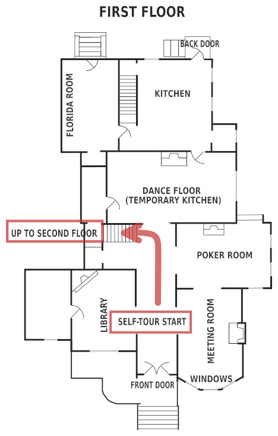

The "ENGINEERING" route has you "start at the top and work your way down". Start on third floor, then kitchen, then exterior, and end in basement.

When you are ready, start in the front hallway and go upstairs to tour the third floor.

 <a href="{{ link_url | relative_url }}">

<button>
THIRD FLOOR
</button>
</a>

