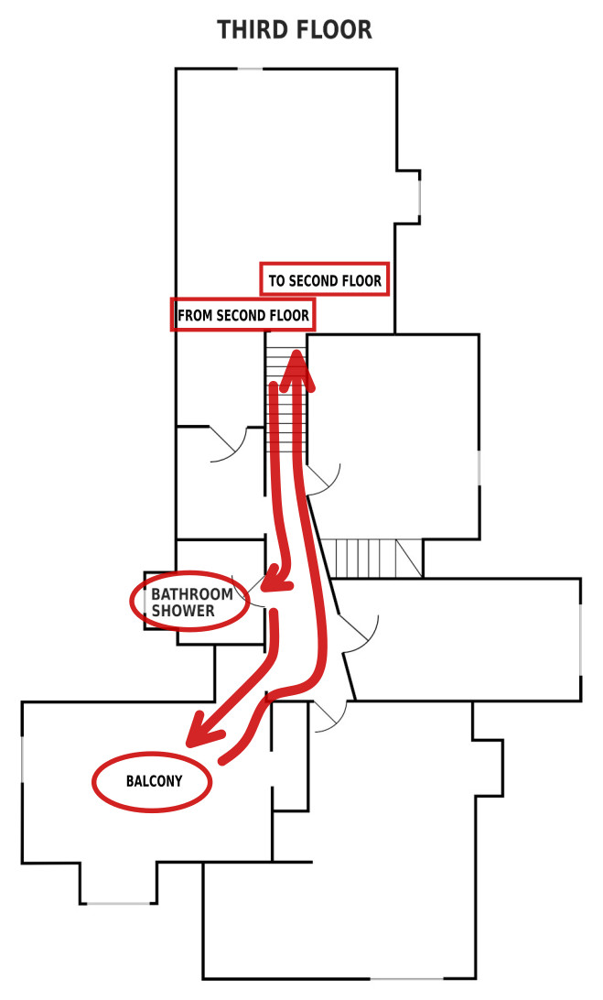

The third floor tour stops include the shower/bathroom and the balcony.  When you arrive at the first tour stop, click the button below.

Forward to

<a href="{{ link_url | relative_url }}">
<button>
SHOWER
</button>
</a>

