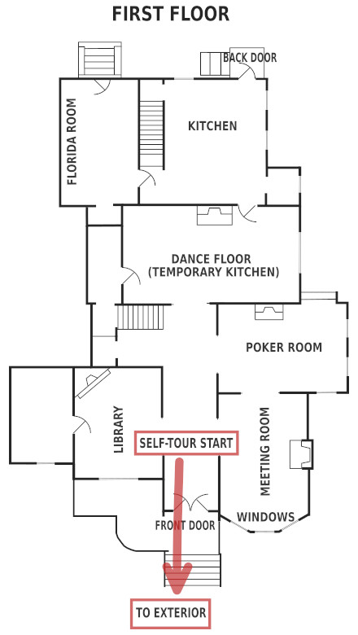

The "WAYNE" route is the "regular" tour route. Tour outside first, then the first floor and kitchen, basement, and end on third floor.  Start in the front hallway.

When you are ready, start in the front hallway and go outside to tour the exterior.

 <a href="{{ link_url | relative_url }}">

<button>
EXTERIOR
</button>
</a>

