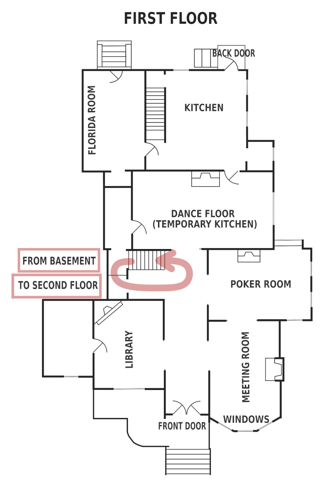
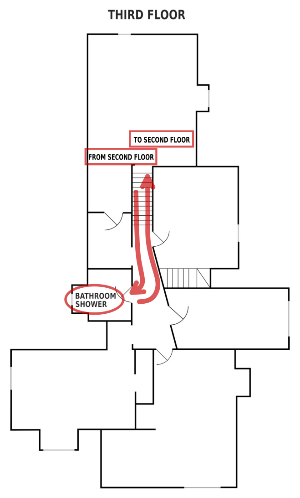

The "WAYNE" route is the "regular" tour route. Start in the main hallway, tour outside exterior first, then the first floor and kitchen, basement, and end on third floor.

 <a href="{{ 'wayne_route_1exterior.html' | relative_url }}">Exterior</a> 

