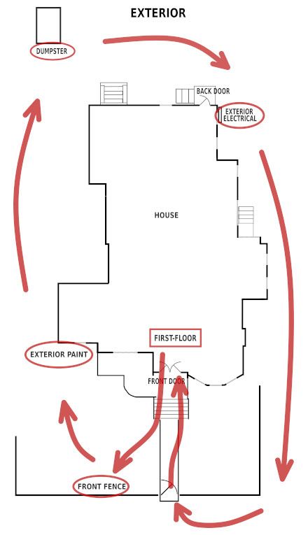

The exterior tour stops include the Front Fence, the exterior paint, the dumpster, and the exterior electrical. When you arrive at the first tour stop, the front fence, click the FRONT FENCE button. 

Forward to
<a href="{{ 'wayne_route_front_fence.html' | relative_url }}">
<button>
FRONT FENCE
</button>
</a>

